# Classification vs Regretion

 - regression predictis <b>Continuous</b> numerical values
    - for exmple house prices temperature and student grades

 - Classification predicts Discrete, categotcal labels
    - yes/no spam/not spam

## Linier regression
 - statistical method used to model relationship between variables by fitting a straight line to the observed data
 - primary goal is to predict a continuous dependant variable Y based on independent variable X

 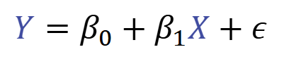

 - Line of best fit is calculated using the method of least squares

## Logistic Regression
like linier regression but classification
 - used for <b>binary classification</b>
 - classification algorithm that predicts a probability which is mapped to discrete class.
 - type of <b>Generalised Linear Model</b> (GLM) that models the log-odds of a catagorical outcome

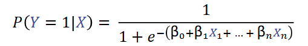

 - instead of modelling the response variable Y directly it models the probability P(Y=1) using the logistic function, also known as <b>Sigmoid Funciton</b>
 - the function squashes the linear output to a value which is interpreted as a probability

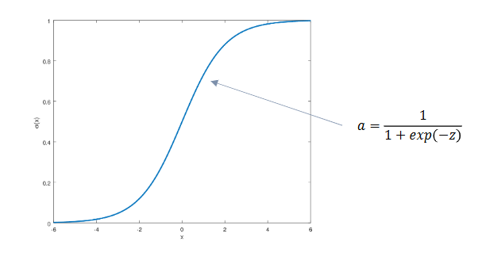
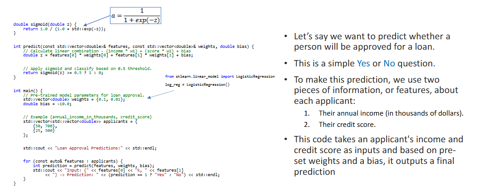

## Feature Scaling
 - preprocessing step used to ensure that<b> all numerical features contribute equally to a models learning process
 - transforms the range or distribute of numertical features so that one variable doesnt dominate</b> 
There are two main methods
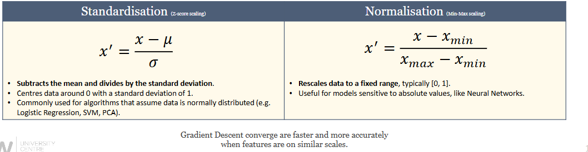

## Imputation

<b>Replaces missing data and values with substituted estimates</b>

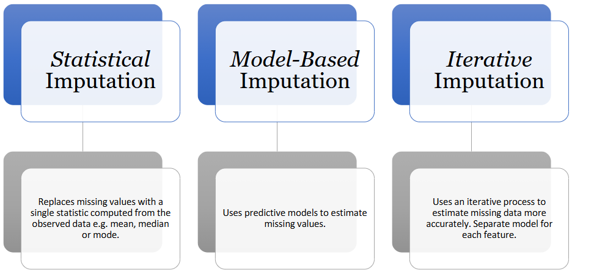

#### Statistical Imputation
(Mean/Median/Mode)

<b>Benefits</b>
 - Simple and fast: Easy to implement and computationally efficient.
 - No risk of overfitting: Does not use relationships between features, so less risk of introducing bias from the model.
 - Works well for low missingness: Effective when only a small fraction of data is missing.

<b>Drawbacks</b>
 - Ignores feature relationships: Does not use information from other columns, so can reduce data variability and distort distributions.
 - Can bias results: Especially if data is not missing completely at random.
 - Not suitable for complex patterns: Fails if missingness depends on other features

### Model-based
(Imputation using a specific predictive model, e.g., KNN, Random Forest, or regression for missing values in a column)

<b>Benefits</b>
 - Leverages relationships: Uses a machine learning model to predict missing values, potentially increasing accuracy.
 - Customizable: You can choose the model best suited for your data (e.g., KNN, Random Forest, etc.).
 - Can handle non-linearities: Especially if using tree-based models.

<b>Drawbacks</b>
- Requires model selection/tuning: You must choose and tune the model for best results.
 - Computational cost: Training a model for each feature with missing values can be slow.
 - Risk of bias: If the model is not appropriate, it can introduce bias or overfit.

### Iterative Imputation
(e.g., IterativeImputer in scikit-learn)

<b>Benefits</b>
 - Uses all features: Each feature with missing values is modeled as a function of other features, improving accuracy if features are correlated.
 - Handles multiple columns: Can impute several columns with missing values at once.
 - Flexible: Can use different estimators (linear regression, decision trees, etc.) for the iterative process.

<b>Drawbacks</b>
 - Computationally intensive: Much slower than simple imputation, especially with large datasets or many features.
 - Complexity: More difficult to implement and interpret.
 - Potential for overfitting: If not careful, especially with small datasets or too many iterations.

### Ensemble Methods

ML techique where <b>predictions from multiple models are combined to produce a single, superior prediction</b>.

 - core principle is that a diverse committee of models will outperform any individule member

#### Decision Trees

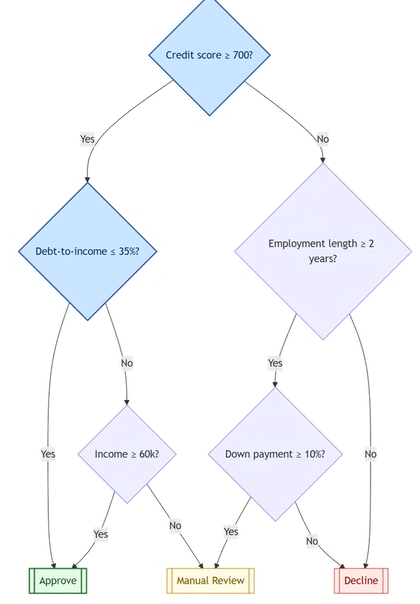

 - in a sense it is a flowchart
 - always supervised learning
 - predicts valuse of target variable by learning simple decision rules inferred from data features
 - process of building tree is <b>Recursive Partitioning</b>
 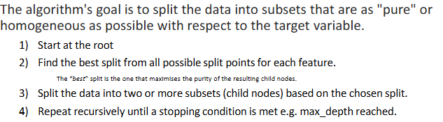
 - goal is to choose a split that results in the largest reduction in impurity for classification this is commonl done with Gini impurity  

### Random forest
 - Builds hundreds of decision trees and combines their predictions
 - Main weakness of decision tree: <b>overfitting</b>
 - <b>trained on a different random sample of the data
 - reduces variance</b> makes the model more stable by averaging ou the individual tree errors
 - <b>decorrelates the trees</b> forcing them to be diverse and prevent the model from relying too heavily on a few dominant feature.
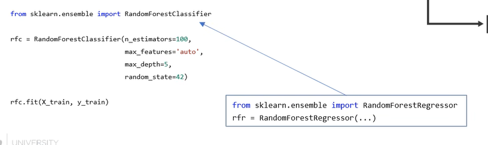
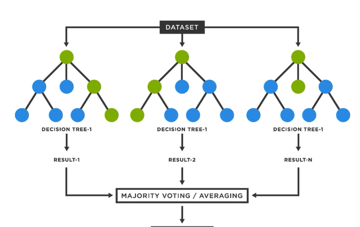

### Gradient boosting

 - Ensemble ML technique that builds a strong predictive model by sequentially adding weak learner models.
 - each new model is <b>trained to correct errors made by the combination of the previous model.</b>
 - the idea is to combine many simple models into more powerfule models
 - random forest builds models in parallel, gradient boosting builds them sequentially
 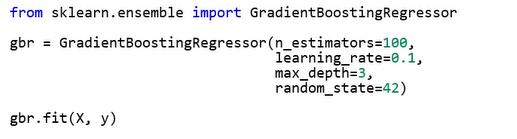
 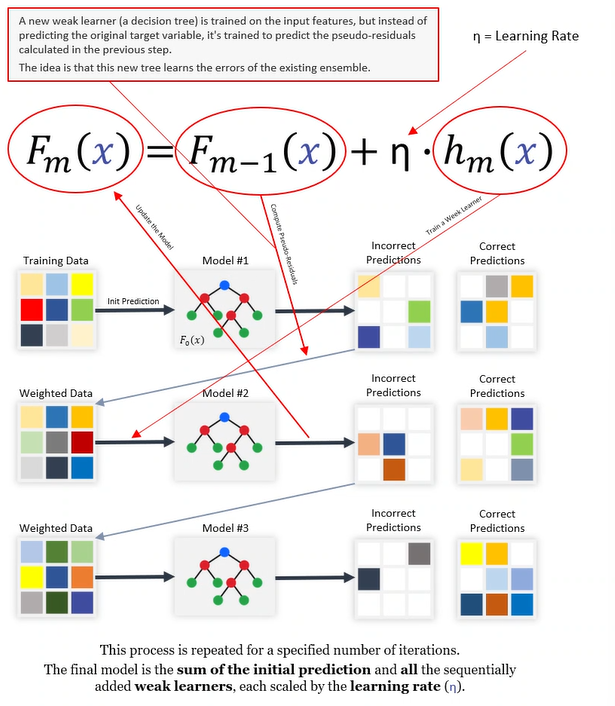

### Gradient vs forest
#### Gradient
 - need <b>highest possible accueacy</b>
 - spend time <b>tuning yperparameters</b>
 - <b>computational resorces</b> for a potentially longer time

#### Forest
 - <b>strong, reliable baseling model quickly</b>
 - <b>easy to impliment and tune
 - concerned about overfitting</b> and need a stronger model
 - take advantage of <b>parallel processing</b> to speed p training 

### eXtream Gradient Boosting
<b>XGBoost is widley considered one of the most ppowerful and effective predictive algorithms avalible</b>

### Support Vector Machines
 - <b>finds an optimll hyperplane to separate data points into different classes
 - </b>effectiveness depends heavily on problem
 - more modden algorithms provide better performance and training times
 - still important anre now a bit obsolete

### Stacked Generalisation
 - EML that combines predictions from multiple models to generate a new often more powerful final prediction.
 - uses a "meta-model" whosejob is to learn the best way to combine the outputs of several "base Models".
 - extreamly effeective
 - prodcing some of most accurate and powerful predictive models avalible but complex to impliment and slow to train. 
 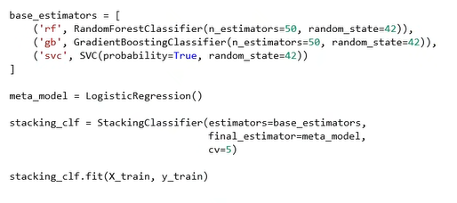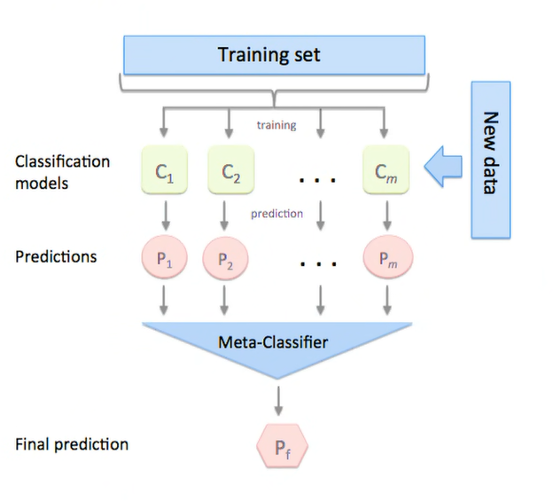

### Model parametes
<b> these are what the models learn</b>
 - these are <b>values that the model learns on its own</b>
 - dont see them manually

#### Hyperparameters
 - very important to have and what you pick
 - they are the config settings set before process begins
 - control how model learns
 they are not learned from data they are external to it 
 - the choice of them has a significant impact on model performance incorrectly set could lead to over and under fitting

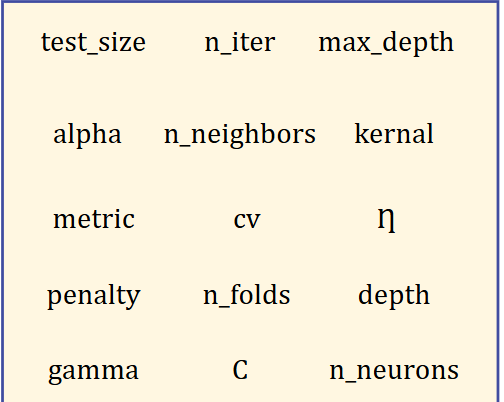
#### hyperparameter tuning
 - process of systematically <b>searching for the combination of hyperparameter values that results in the best performance

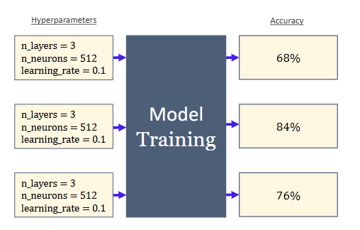

#### hyperparameters w/ Combinatorics
 - <b>hyper parameter tuning is a search problem</b>
 - you have a <b>discrete set</b> if hyperparameters and eachhas a range of possible values
 - <b>trying to find the single optimal combination</b> ou of vast final set of possibilities that maximises a specific <b>objective function</b> (fitness function)

 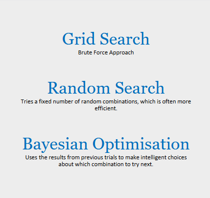
 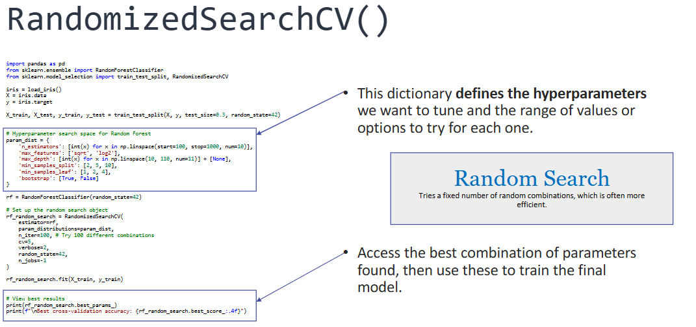